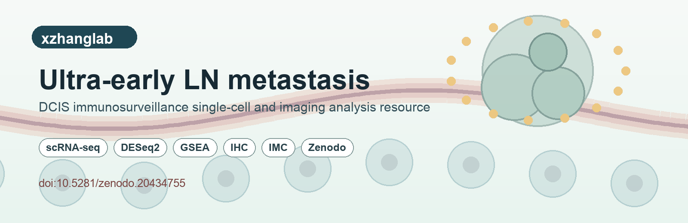

<p align="center">
  
</p>

# Ultra early lymph node metastasis is a part of immunosurveillance and inhibits DCIS progression

[](https://doi.org/10.5281/zenodo.20434755)

This repository is the manuscript companion resource for the study above. It collects the analysis notebooks, R Markdown workflows, sample metadata, and Zenodo-hosted processed datasets used to reproduce the single-cell, differential-expression, pathway, and imaging-support analyses from the paper.

## Companion spatial imaging analysis repository

For multichannel IMC data spatial imaging analysis, we used the published pipeline:

- **TME Spatial:** [fengshuoliu/TME_spatial](https://github.com/fengshuoliu/TME_spatial)

### How the two repositories connect

| Resource | Primary purpose | Use this when you want to... |
| --- | --- | --- |
| **This repository** | Reproduce the manuscript-level scRNA-seq, pathway, metadata, and supporting imaging-analysis organization | Follow the paper workflow, inspect the scripts behind the figures, and connect the code to the Zenodo data deposit |
| **TME Spatial** | Run the multichannel spatial-imaging workflow used for IMC image analysis | Re-run or adapt the IMC spatial-analysis workflow, ROI analysis, cell distribution analysis, nearest-neighbor analysis, and distance analysis |

If you are mainly interested in the **multichannel IMC spatial imaging analysis**, start with **TME Spatial**.  
If you want the broader **paper reproduction resource**, including scRNA-seq and pathway workflows, start with **this repository**.

## Project links

| Link | Description |
| --- | --- |
| [GitHub repository](https://github.com/xzhanglab/Ultra-early-LN-metastasis) | Analysis code and metadata for this manuscript resource |
| `index.html` | Static project-page source for GitHub Pages-style deployment |
| [Zenodo deposit](https://zenodo.org/records/20434756) | Restricted processed and analysis-ready data deposit |
| [Zenodo concept DOI](https://doi.org/10.5281/zenodo.20434755) | DOI to cite the full Zenodo record series |
| [Zenodo version DOI](https://doi.org/10.5281/zenodo.20434756) | DOI for the current v1 record |
| [TME Spatial repository](https://github.com/fengshuoliu/TME_spatial) | Published pipeline used for multichannel IMC spatial imaging analysis |

## Citation

If you use this resource, please cite the associated study and Zenodo data deposit:

Ding Y, Liu F, Yang L, Wu L, Xu Z, Feng D, Yang C, Wang S, Hoffman D, Choi J, Hao X, Yu L, Li X, Guan N, Gao Y, Liu J, Edwards DG, Chan HL, Wu Y-H, Xiao H, Lu Y, Wu W, Bu W, Li Y, Behbod F, Zhang XH-F. *Ultra early lymph node metastasis is a part of immunosurveillance and inhibits DCIS progression.*

Zenodo concept DOI: [10.5281/zenodo.20434755](https://doi.org/10.5281/zenodo.20434755)

## Overview

This repository guides you through the following:

1. Processing per-sample 10x Genomics scRNA-seq outputs and generating Seurat objects.
2. Integrating single-cell objects, applying batch correction, clustering, and annotating cell populations.
3. Preparing pseudobulk count matrices for DESeq2.
4. Running differential gene-expression and pathway-enrichment analyses.
5. Generating manuscript-level Scanpy and R visualizations.
6. Connecting the GitHub code to Zenodo-hosted processed datasets and the TME Spatial imaging-analysis workflow.

## Analysis pipeline files

| File name | Description |
| --- | --- |
| `code/01.batch individual processing.R` | Process Cell Ranger outputs and generate individual Seurat objects |
| `code/01.2.integration.Rmd` | Integrate scRNA-seq objects, run batch correction, clustering, annotation, and object export |
| `code/02.0_Matrix.utils.R` | Utility functions for sparse/dense matrix aggregation used in pseudobulk processing |
| `code/02.1_data_processing_for_DESeq2.Rmd` | Aggregate single-cell counts by sample/cell type and prepare DESeq2 inputs |
| `code/02.2_DESeq2.Rmd` | Differential gene-expression analysis, PCA, sample correlation, volcano plots, and heatmaps |
| `code/02.3_GSEA.Rmd` | Gene set enrichment analysis and pathway visualization |
| `code/Code for generate plots.ipynb` | Python/Scanpy notebook for manuscript plotting and exploratory summaries |

## Metadata files

| File | Description |
| --- | --- |
| `scRNA.metatable.xlsx` | Original sample metadata workbook |
| `metadata/scRNA.metatable.csv` | Machine-readable CSV export of the named columns in the metadata workbook |
| `metadata/scRNA.metatable.schema.csv` | Column profile for the metadata CSV, including non-empty counts, unique-value counts, and examples |

## Data files from Zenodo

The processed and analysis-ready datasets are available through the restricted Zenodo record:

- Record: [https://zenodo.org/records/20434756](https://zenodo.org/records/20434756)
- Concept DOI: [10.5281/zenodo.20434755](https://doi.org/10.5281/zenodo.20434755)
- Version DOI: [10.5281/zenodo.20434756](https://doi.org/10.5281/zenodo.20434756)

The Zenodo record contains the processed datasets supporting the mouse tumor study, including:

| Dataset group | Description | Connection to this repository |
| --- | --- | --- |
| Mouse scRNA-seq Cell Ranger output matrices | Demultiplexed/processed 10x Genomics matrices | Input to the per-sample Seurat processing workflow |
| Per-sample Seurat RDS objects | Individual sample-level Seurat objects | Input to integration and annotation workflows |
| Integrated scRNA-seq objects | Integrated objects in RDS and H5AD formats | Input to downstream plotting, DEG, and pathway workflows |
| Sample metadata | Sample-level metadata used to annotate scRNA-seq analyses | Mirrored in this repository as Excel and CSV metadata |
| IHC image-analysis inputs and outputs | Immunohistochemistry analysis files and derived results | Supporting imaging-analysis resource |
| IMC image-analysis inputs and outputs | Multichannel IMC data, masks, annotations, derived spatial tables, and visual outputs | Spatial imaging analysis was performed using the published TME Spatial pipeline |
| Human DCIS scRNA-seq reference dataset | Human DCIS reference data provided by Dr. Fariba Behbod's group, available under GEO accession `GSE333697` | Supporting cross-species/reference analysis resource |

The Zenodo page lists the record as restricted access. Use the Zenodo record page to request or confirm file access.

## Local reanalysis notes

Large generated objects are intentionally not committed to this repository, including Cell Ranger outputs, Seurat `.rds` objects, AnnData `.h5ad` files, DESeq2 `.rds` objects, and rendered figure outputs.

Expected local working directories used by the scripts include:

```text
data/cellranger_outs/processed/
data/merged/
data/LTA_vs_WT/
outs/
```

Some notebooks retain original lab-local `setwd()` paths from the analysis workstation. To rerun outside that environment, edit those paths to the repository root and place downloaded or processed input data under the relative directories above.

## Software

The analysis uses R/Seurat/Bioconductor and Python/Scanpy. Package lists are provided in:

- `r-packages.txt`
- `requirements.txt`

Exact package versions may depend on the original analysis environment. For manuscript reproduction, record R `sessionInfo()` and Python package versions after rebuilding the environment.

## Prepared by

Fengshuo Liu
